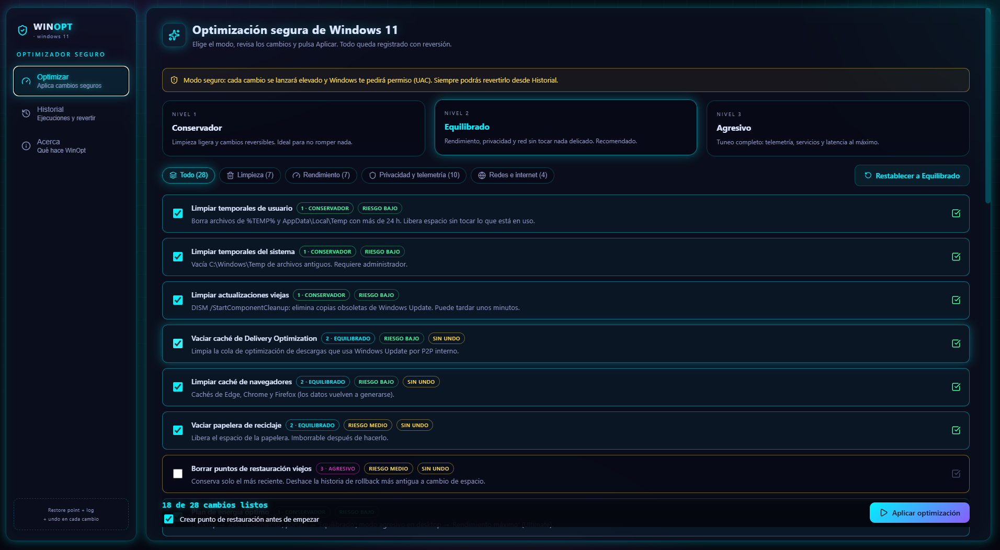

# 🔥 WinOpt — Optimizador seguro y reversible de Windows 11


> **Elige un modo. Aplica. Revierte lo que quieras — ítem por ítem o todo.**
> WinOpt optimiza Windows 11 sin sustos: cada cambio guarda su valor anterior y puedes deshacerlo en cualquier momento desde el historial de la app.



📖 **English:** read the English version in [README.md](README.md).

---

## ✨ Características

- **28 optimizaciones** en 4 áreas: **limpieza**, **rendimiento**, **privacidad y telemetría** y **redes e internet**.
- **3 modos** — Conservador, Equilibrado y Agresivo — o marca tú mismo los ítems que quieras.
- **100% reversible**: cada ítem guarda una copia de lo que cambió (valores de registro, servicios, plan de energía, DNS...). Revierte un ítem o toda la ejecución desde la pestaña **Historial**.
- **Punto de restauración del sistema** (opcional) antes de aplicar, si está disponible.
- **La app NO necesita permisos de administrador**: el motor de optimización se ejecuta elevado mediante un aviso de UAC, así la interfaz queda aislada.
- **UI nativa y ligera** (Tauri 2 + React) — sin Electron, sin inflado.
- **Historial solo local** en `%LOCALAPPDATA%\WinOpt\history.json`. Nada sale de tu PC.

## 🎚️ Modos

| Modo | Ítems | Para qué |
| --- | --- | --- |
| 🟢 **Conservador** | 5 | Limpiezas seguras que todos aprueban |
| 🟡 **Equilibrado** | 14 | Rendimiento y privacidad de cada día |
| 🔴 **Agresivo** | 28 | Máximo rendimiento y privacidad |

## 🛡️ Cómo se mantiene seguro

1. Cada ítem **guarda su valor anterior** antes de tocar el sistema.
2. Se solicita un **punto de restauración** opcional antes de la ejecución.
3. El motor escribe un **registro de la ejecución** con los datos de reversión de cada ítem aplicado.
4. Desde **Historial** puedes **revertir un ítem** o **revertir la ejecución completa** — incluso en sesiones posteriores.
5. Nada se pierde de forma permanente: plan de energía, hibernación, DNS, servicios y valores de registro vuelven a su estado exacto anterior.

## ⚙️ Cómo funciona

```
┌──────────────────┐   invoke (Tauri)  ┌──────────────────────────┐
│  Interfaz React  │ ───────────────> │  Orquestador Rust (app)  │
│  (3 pestañas)    │ <─────────────── │  catálogo · historial    │
└──────────────────┘                  └────────────┬─────────────┘
                                                   │ elevado vía UAC
                                                   v
                                        ┌──────────────────────┐
                                        │  engine.ps1 (admin)  │
                                        │  aplica + respaldos  │
                                        └──────────────────────┘
```

- El **catálogo de optimizaciones vive en Rust** (`src-tauri/src/models.rs`); la UI nunca define lógica del sistema.
- El motor va **embebido en el binario** y se ejecuta **elevado** con un solo aviso de UAC vía `src-tauri/resources/engine.ps1` + un envoltorio oculto `launcher.ps1` — la app en sí nunca corre como admin.

## 🚀 Instalación

Descarga el instalador de la sección **Releases**:

| Instalador | Notas |
| --- | --- |
| `WinOpt_x64-setup.exe` | Instalador NSIS — recomendado |
| `WinOpt_x64_en-US.msi` | Paquete MSI |

> ⚠️ Usa el modo *Agresivo* solo en sistemas que controlas. Todo puede revertirse desde Historial, y un punto de restauración antes de ejecutar es el hábito más seguro.

## 🔨 Compilar desde el código

Requisitos: **Node 20+**, **Rust stable** y el runtime **WebView2** (venía instalado en Windows 11).

```powershell
git clone https://github.com/putx4/WinOpt.git
cd WinOpt
npm install
npm run tauri build        # genera NSIS + MSI en src-tauri/target/release/bundle/
```

Para desarrollo con recarga en caliente:

```powershell
npm run tauri dev
```

## 🧪 Comprobaciones de desarrollo

```powershell
npm run lint       # oxlint
npx tsc -b         # typescript
cargo clippy       # lints de Rust (src-tauri/)
```

## 🗂️ Estructura del proyecto

```
src/                 # UI de React (Optimizar / Historial / Info)
src-tauri/src/       # Rust: modelos, comandos, app Tauri
src-tauri/resources/ # engine.ps1 — el motor de optimización elevado (el corazón)
src-tauri/public/    # iconos
docs/                # capturas de pantalla
```

## 📄 Licencia

[MIT](LICENSE) © 2026 Luis Solano